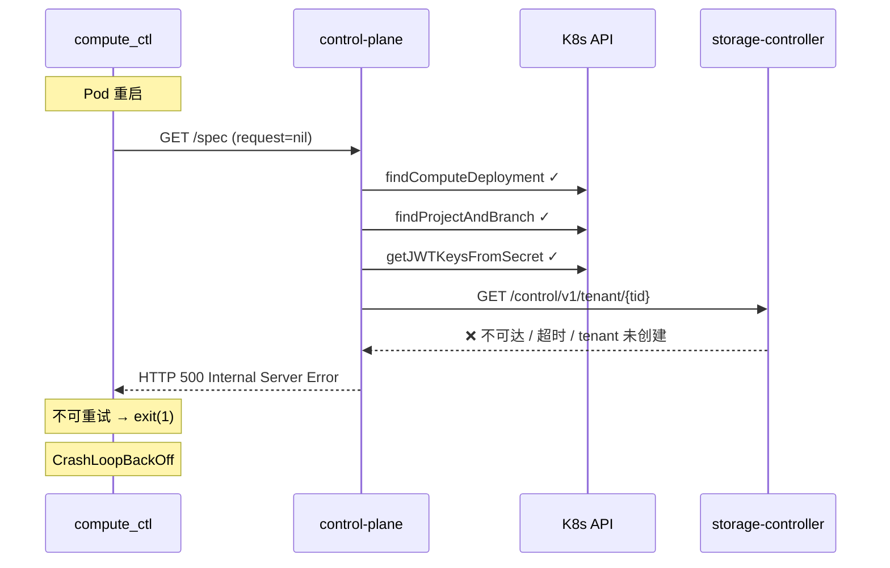
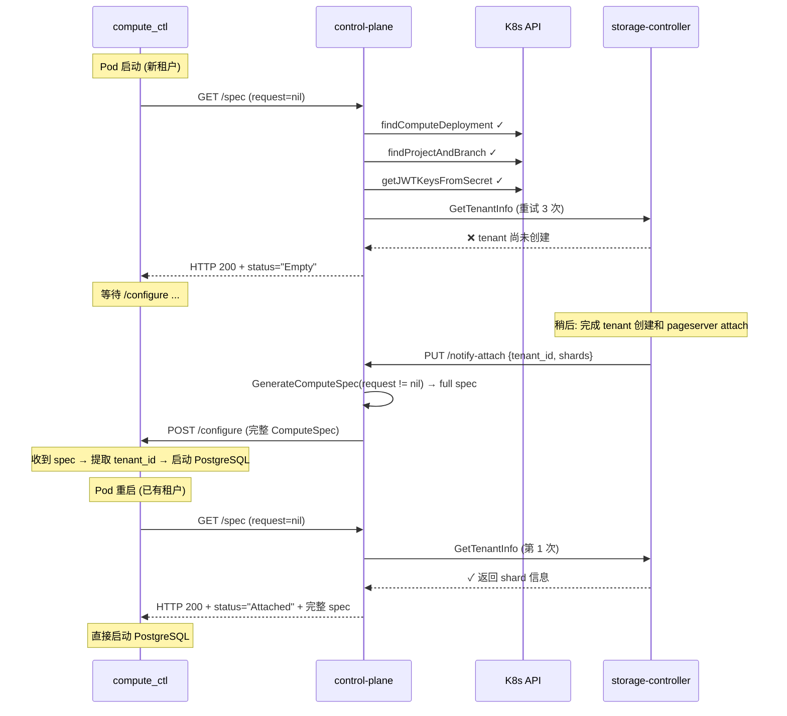

# 设计方案：`GET /spec` 端点韧性增强 — 根治 compute_ctl CrashLoopBackOff

| 字段 | 内容 |
|------|------|
| 版本 | v2.0 |
| 日期 | 2026-06-25 |
| 作者 | — |
| 状态 | 草案 |

---

## 1. 问题摘要

### 现象

compute pod 被删除重建后，`compute_ctl` 调用 `GET /compute/api/v2/computes/{compute_id}/spec` 返回 HTTP 500，compute_ctl 立即退出，Pod 进入 Error → CrashLoopBackOff 循环。问题反复出现，无法自愈。

### 根因

`handleComputeSpec` 调用 `GenerateComputeSpec` 时传入 `request=nil`（routes.go:66），导致走 fallback 路径去查询 storage-controller 的 `/control/v1/tenant/{tenantID}`。当 storage-controller 不可达（首次创建、Pod 重启时序竞争、网络抖动），`GetTenantInfo` 失败 → `GenerateComputeSpec` 返回 error → control plane 返回 HTTP 500 → compute_ctl 不可重试此状态码，立即退出。



对比上游 Neon：控制平面有自己的数据库存储 tenant→shard 映射，`/spec` 总是能构建完整 spec 或返回 `Empty`（让 compute_ctl 等待 `/configure`），绝不会返回 500。

---

## 2. 设计原则

| 原则 | 说明 |
|------|------|
| **/spec 永远不 500** | 对于合法 compute_id，只允许返回 `Attached + 完整 spec` 或 `Empty`（等待 /configure），不允许返回错误 |
| **对齐上游语义** | 上游 compute_ctl 已经内置 `Empty → wait-for-configure` 状态机，复用而非重建 |
| **自愈优先** | 即使 storage-controller 暂时不可达，系统能自行恢复，不需要人工介入 |
| **最小改动** | 只改 spec 生成逻辑，不改路由、CRD、Reconciler |

---

## 3. 解决方案总览

### 3.1 三层防御体系

```
┌──────────────────────────────────────────────────────────┐
│ Layer 1: ConfigMap 注入 tenant_id + timeline_id           │
│          compute_ctl 启动即获完整身份，无需网络调用       │
├──────────────────────────────────────────────────────────┤
│ Layer 2: GetTenantInfo 重试 + 退避                        │
│          处理 storage-controller 短暂不可达 (网络抖动)     │
├──────────────────────────────────────────────────────────┤
│ Layer 3: /spec 返回 Empty 状态 (优雅降级)                 │
│          处理 storage-controller 长期不可达 (首次创建)     │
│          compute_ctl 等待 /notify-attach → /configure     │
└──────────────────────────────────────────────────────────┘
```

### 3.2 核心逻辑变化

```
修改前:
  request == nil → GetTenantInfo  → 失败 → return err → HTTP 500 → CrashLoop

修改后:
  request == nil → GetTenantInfo(带重试)
                  ├─ 成功 → 构建完整 spec, "attached" ──── HTTP 200
                  └─ 失败 → 构建部分 spec, "Empty"  ──── HTTP 200 → 等待 /configure
```

---

## 4. 详细设计

### 4.1 Layer 1: ConfigMap 注入租户 + 分支标识

**文件**: `specs/compute/configmap.go` → `ConfigMap()`

#### 设计动机

`ConfigMap()` 创建时已持有 `project` 和 `branch` 对象，拥有完整的 `tenant_id` 和 `timeline_id`。compute 容器启动时先将 `$INITIAL_SPEC_JSON`（来自 ConfigMap 的 `spec.json`）写入 `/var/spec.json`，**然后才**发起 `GET /spec` 网络请求（见 `deployment.go:64-71`）。

ConfigMap 注入的实质意义：
1. **本地自识别**：compute_ctl 在发起任何网络调用前就能知道自己的 tenant_id + timeline_id，不需要依赖 control plane
2. **校验锚点**：后续 `/spec` 或 `/configure` 返回的 identity 若与本地不符，可检测配置错误
3. **对齐上游**：上游 compute_ctl 的 `ParsedSpec::try_from()` 从本地 spec 文件提取 `cluster_id` 作为 tenant 标识

> **为什么必须同时注入 tenant_id 和 timeline_id？**
>
> 一个 tenant 可以包含多个 timeline（分支分叉产生）。compute 节点需要同时知道两个 ID 才能连接到正确的存储分片：
> - `tenant_id` → 确定属于哪个存储租户（pageserver 上的隔离单元）
> - `timeline_id` → 确定该租户内的哪个分支/WAL 时间线
>
> 若只注入 tenant_id，compute_ctl 拿到 Empty spec 后仍然不知道自己该启动哪个 timeline 的 PostgreSQL，等待 `/configure` 推送完整信息——这比直接知道要慢一轮。

#### 当前 ConfigMap

只包含 JWKS：
```json
{
  "format_version": "1.0",
  "compute_ctl_config": { "jwks": { "keys": [...] } }
}
```

#### 目标 ConfigMap

注入完整的身份信息（tenant_id + timeline_id）：
```json
{
  "format_version": "1.0",
  "cluster": {
    "cluster_id": "a454c1a8ec748404629288934a364acb",
    "name": "my-project",
    "roles": [],
    "databases": [],
    "settings": [
      { "name": "neon.tenant_id",   "value": "a454c1a8ec748404629288934a364acb", "vartype": "string" },
      { "name": "neon.timeline_id", "value": "a454c1a8ec748404629288934a364acb", "vartype": "string" }
    ]
  },
  "compute_ctl_config": { "jwks": { "keys": [...] } }
}
```

> **命名说明**：`cluster_id` 是上游 Neon 的历史命名，其语义值 = tenant_id，**不是** timeline_id。这是上游遗留的不一致命名，本实现遵循上游 schema 以保证兼容性。

#### 代码变化

```go
// 新增结构体（复用 spec.go 中已有的类型）
// clusterConfig 对应 ComputeSpec 中的 ClusterConfig

// computeSpec 增加 Cluster 字段
type computeSpec struct {
    FormatVersion    string              `json:"format_version"`
    Cluster          computeClusterConfig `json:"cluster"`           // 新增
    ComputeCtlConfig computeCtlConfig    `json:"compute_ctl_config"`
}

type computeClusterConfig struct {
    ClusterID string          `json:"cluster_id"`
    Name      string          `json:"name"`
    Roles     []interface{}   `json:"roles"`
    Databases []interface{}   `json:"databases"`
    Settings  []SettingsEntry `json:"settings"`
}
```

#### 字段来源

| 字段 | 来源 | 说明 |
|------|------|------|
| `cluster.cluster_id` | `project.Spec.TenantID` | 存储租户 ID（上游命名为 cluster_id，不变） |
| `cluster.name` | `project.Name` | 项目名 |
| `cluster.settings[neon.tenant_id]` | `project.Spec.TenantID` | PostgreSQL GUC 参数，与 cluster_id 一致 |
| `cluster.settings[neon.timeline_id]` | `branch.Spec.TimelineID` | 分支/timeline 标识 |
| `cluster.roles` / `databases` | 初始化为空数组 | 完整值由后续 `/configure` 补充 |

### 4.2 Layer 2: GetTenantInfo 重试 + 退避

**文件**: `specs/compute/spec.go` → `GenerateComputeSpec()`

在调用 `GetTenantInfo` 失败时，不立即放弃，而是重试：

```go
// 重试策略: 最多 3 次，间隔 1s / 2s / 4s
var tenantInfo *TenantInfo
var lastErr error
for attempt := 0; attempt < 3; attempt++ {
    tenantInfo, lastErr = storageClient.GetTenantInfo(ctx, log, tenantID)
    if lastErr == nil {
        break
    }
    log.Warn("GetTenantInfo failed, retrying",
        "attempt", attempt+1, "tenantID", tenantID, "error", lastErr)
    select {
    case <-ctx.Done():
        return nil, ctx.Err()
    case <-time.After(time.Duration(1<<attempt) * time.Second):
        // 1s, 2s, 4s 退避
    }
}
```

覆盖场景：
- storage-controller Pod 与 compute Pod 同时重启（Service iptables 同步延迟 1-3s）
- 瞬时网络抖动
- DNS 缓存更新短暂延迟

### 4.3 Layer 3: /spec 返回 Empty 状态（核心）

**文件**: `specs/compute/spec.go` → `GenerateComputeSpec()`

这是最关键的变更。当三层重试后 `GetTenantInfo` 仍然失败，不返回 error，而是构建一个 **status="Empty"** 的响应：

```go
if lastErr != nil {
    // storage-controller 目前不可达，返回 Empty 状态
    // compute_ctl 将等待 /configure 推送完整 spec
    log.Warn("Storage controller unavailable, returning Empty status",
        "tenantID", tenantID, "error", lastErr)

    // 利用已从 K8s 获取的数据构建最小可用 spec
    return &ComputeSpecResponse{
        Spec: ComputeSpec{
            FormatVersion:         1.0,
            SuspendTimeoutSeconds: -1,
            Cluster: ClusterConfig{
                ClusterID: project.Spec.TenantID,       // ← 正确 tenant_id
                Name:      project.Name,
                Roles: []Role{{                         // 内置 postgres 角色
                    Name:              "postgres",
                    EncryptedPassword: "SCRAM-SHA-256$...",
                }},
                Databases: []interface{}{},
                Settings:  settings,                     // ← 含 neon.tenant_id / neon.timeline_id
            },
            DeltaOperations:       []interface{}{},
            SafekeeperConnstrings: safekeeperConnstrings,
            PageserverConnectionInfo: PageserverConnectionInfo{
                ShardCount: 0,
                Shards:     map[string]PageserverShardInfo{},
            },
        },
        ComputeCtlConfig: ComputeCtlConfig{
            JWKS: jwks,
        },
        Status: "Empty",
    }, nil  // ← 不返回 error，HTTP 200
}
```

**为什么 `return nil` error 而非 error**：
- `handleComputeSpec`（routes.go:67-71）看到 `err != nil` 就返回 500
- 返回 `nil` error + `status="Empty"` → `encode` 返回 200 + Empty spec
- compute_ctl 看到 200 + Empty → 进入等待 `/configure` 状态

**为什么 Empty 响应中包含 cluster 配置**：
- 上游 `ParsedSpec::try_from()` 尝试从两种途径读取 tenant_id：
  1. `spec.tenant_id` 顶层字段
  2. `spec.cluster.settings` 中的 `neon.tenant_id` GUC
- 我们的 spec 将 tenant_id 写入 `cluster.settings`（通过 `buildPostgresSettings()`）
- compute_ctl 可以从 settings 中提取正确 tenant_id，不会"随机生成"

### 4.4 完整数据流



---

## 5. 场景覆盖矩阵

| 场景 | GetTenantInfo | Layer 1 (ConfigMap) | Layer 2 (Retry) | Layer 3 (Empty) | 最终结果 |
|------|:---:|:---:|:---:|:---:|------|
| 正常启动 (storage-controller 就绪) | ✓ | — | — | — | 200 + Attached |
| storage-controller 短暂抖动 (<7s) | 重试后 ✓ | — | 1s→2s→4s 后成功 | — | 200 + Attached |
| 新租户首次创建 (SC 未注册 tenant) | ✗ | tenant_id+timeline_id 注入 | 3次均失败 | 200 + Empty | 等待 /notify-attach |
| Pod 重建 + SC 同时重启 (>7s) | ✗ | tenant_id+timeline_id 注入 | 3次均失败 | 200 + Empty | 等待 SC 恢复（需要额外机制） |
| 旧 ConfigMap (无 cluster) + SC 不可达 | ✗ | — | 3次均失败 | 200 + Empty | 等待（但无身份保底） |

**关于 "Pod 重建 + SC 同时重启" 场景**：这是最坏情况。compute_ctl 收到 Empty 后等待 `/configure`，但 storage-controller 不会主动重发 `/notify-attach`（因为 tenant→shard 映射未变化）。后续可在 v2.1 中增加 **ConfigMap 缓存 pageserver shard** 来覆盖此场景（见第 8 节）。

---

## 6. 修改清单

| 文件 | 函数 | 变更类型 | 变更内容 |
|------|------|----------|----------|
| `specs/compute/configmap.go` | `ConfigMap()` | 修改 | `computeSpec` 增加 `Cluster` 字段，注入 `cluster_id`(=tenant_id) + `name` + settings 含 `neon.tenant_id` 和 `neon.timeline_id` |
| `specs/compute/spec.go` | `GenerateComputeSpec()` | 修改 | `GetTenantInfo` 调用增加 3 次重试；最终失败后构建 Empty 响应而非返回 error |
| `specs/compute/spec.go` | `GetTenantInfo()` | 不变 | 保持现有逻辑，由调用方负责重试 |

### 不涉及的文件

| 文件 | 原因 |
|------|------|
| `internal/controlplane/routes.go` | `handleComputeSpec` 逻辑不变：`err != nil` → 500, `err == nil` → 200 encode |
| `internal/controller/branch_create.go` | `DeepDerivative` 自动检测 ConfigMap 数据变更并更新 |
| `specs/compute/deployment.go` | Deployment labels/annotations 已正确 |
| 任何 CRD 类型定义 | 无变更 |

---

## 7. 代码实现概要

### 7.1 configmap.go 变更

```go
// 新增结构体
type clusterConfig struct {
    ClusterID string        `json:"cluster_id"`
    Name      string        `json:"name"`
    Roles     []interface{} `json:"roles"`
    Databases []interface{} `json:"databases"`
    Settings  []interface{} `json:"settings"`
}

// computeSpec 增加 Cluster 字段
type computeSpec struct {
    FormatVersion    string           `json:"format_version"`
    Cluster          clusterConfig    `json:"cluster"`
    ComputeCtlConfig computeCtlConfig `json:"compute_ctl_config"`
}

func ConfigMap(branch *neonv1alpha1.Branch, project *neonv1alpha1.Project, jwtSecret corev1.Secret) (*corev1.ConfigMap, error) {
    // ... jwtManager, jwk 初始化不变 ...

    spec := computeSpec{
        FormatVersion: "1.0",
        Cluster: clusterConfig{
            ClusterID: project.Spec.TenantID,
            Name:      project.Name,
            Roles:     []interface{}{},
            Databases: []interface{}{},
            Settings: []SettingsEntry{
                {Name: "neon.tenant_id",   Value: project.Spec.TenantID,   Vartype: "string"},
                {Name: "neon.timeline_id", Value: branch.Spec.TimelineID, Vartype: "string"},
            },
        },
        ComputeCtlConfig: computeCtlConfig{
            JWKS: utils.JWKResponse{Keys: []*utils.JWK{jwk}},
        },
    }
    // ... Marshal, 构建 ConfigMap 不变 ...
}
```

### 7.2 spec.go 变更（核心）

```go
func GenerateComputeSpec(ctx context.Context, log *slog.Logger, k8sClient client.Client,
    request *ComputeHookNotifyRequest, computeID string) (*ComputeSpecResponse, error) {

    // ... 步骤 1-5 不变: findComputeDeployment, extract info, get JWT, list safekeepers, build settings ...

    var actualRequest *ComputeHookNotifyRequest
    if request != nil {
        // /notify-attach 路径: 有完整的 shard 信息
        actualRequest = request
    } else {
        // /spec 路径: 需要从 storage-controller 获取 shard 信息
        storageClient := NewStorageControllerClient(clusterName)

        // 三层重试
        var tenantInfo *TenantInfo
        var lastErr error
        for attempt := 0; attempt < 3; attempt++ {
            tenantInfo, lastErr = storageClient.GetTenantInfo(ctx, log, tenantID)
            if lastErr == nil {
                break
            }
            log.Warn("GetTenantInfo failed, retrying",
                "attempt", attempt+1, "tenantID", tenantID, "error", lastErr)
            select {
            case <-ctx.Done():
                return nil, ctx.Err()
            case <-time.After(time.Duration(1<<attempt) * time.Second):
            }
        }

        if lastErr != nil {
            // storage-controller 不可达 → 返回 Empty 状态，让 compute_ctl 等待 /configure
            log.Warn("Storage controller unavailable, returning Empty status",
                "tenantID", tenantID, "error", lastErr)

            return &ComputeSpecResponse{
                Spec: ComputeSpec{
                    FormatVersion:         1.0,
                    SuspendTimeoutSeconds: -1,
                    Cluster: ClusterConfig{
                        ClusterID: project.Spec.TenantID,
                        Name:      project.Name,
                        Roles:     []Role{{Name: "postgres", EncryptedPassword: "SCRAM-SHA-256$..."}},
                        Databases: []interface{}{},
                        Settings:  settings,
                    },
                    DeltaOperations:       []interface{}{},
                    SafekeeperConnstrings: safekeeperConnstrings,
                    PageserverConnectionInfo: PageserverConnectionInfo{
                        ShardCount: 0,
                        Shards:     map[string]PageserverShardInfo{},
                    },
                },
                ComputeCtlConfig: ComputeCtlConfig{JWKS: jwks},
                Status:           "Empty",
            }, nil  // ← 关键: 返回 nil error，不是 error
        }

        // 正常路径: 从 tenantInfo 构建 actualRequest
        fallbackShards := make([]ComputeHookNotifyRequestShard, len(tenantInfo.Shards))
        for i, shard := range tenantInfo.Shards {
            fallbackShards[i] = ComputeHookNotifyRequestShard{
                NodeID:      shard.NodeAttached,
                ShardNumber: uint32(i),
            }
        }
        actualRequest = &ComputeHookNotifyRequest{
            TenantID:   tenantInfo.TenantID,
            StripeSize: &tenantInfo.StripeSize,
            Shards:     fallbackShards,
        }
    }

    // ... 步骤 7 不变: 从 actualRequest 构建 shards ...
    // ... 步骤 8 不变: 构建完整 spec 并返回 ...
}
```

---

## 8. 后续优化 (v2.1)

### 8.1 Pageserver Shard 缓存

当前设计中，Pod 重建 + storage-controller 不可达时，compute_ctl 会进入无限等待（因为 `/notify-attach` 不会重发）。解决方案：

在 `/notify-attach` 成功处理后，将 shard 信息写入 ConfigMap（或 Branch CR annotation）。Pod 重启时，`/spec` 优先从 ConfigMap 读取缓存的 shard 信息，只有缓存未命中时才调用 storage-controller。

```
/notify-attach 成功处理
  └─ 更新 ConfigMap: pageserver-shards-cache = {shard_info}
       │
       └─ Pod 重启时:
            /spec → 读 ConfigMap shard 缓存 → 命中 → 直接构建完整 spec (无需 SC)
```

**不在本设计中实现**，因为当前三层防御已经解决了 CrashLoopBackOff 问题，v2.1 作为性能优化（减少启动等待时间）。

### 8.2 /spec 调用频率控制

当前 compute_ctl 调用 `/spec` 最多 3 次（上游内置重试），但重试间隔仅 100ms。如果 storage-controller 正在重启（需要 30s+），3 次重试后 compute_ctl 退出。建议：

- **选项 A**：在 `/spec` handler 内做更长时间的重试（如 10 次 × 2s = 20s）
- **选项 B**：控制平面返回 503 而非 200+Empty（compute_ctl 对 503 可重试）

当前设计选择"Empty + 等待 /configure"模式，避免阻塞 `/spec` handler 线程。

---

## 9. 测试计划

### 9.1 单元测试

| 测试用例 | 文件 | 验证点 |
|----------|------|--------|
| `ConfigMap` 包含 `cluster.cluster_id` | `configmap_test.go` | JSON 中存在 cluster.cluster_id 字段 |
| `ConfigMap` 中 `cluster_id` == `project.Spec.TenantID` | `configmap_test.go` | 值正确传递 |
| `GenerateComputeSpec` request=nil + GetTenantInfo 成功 → Attached | `spec_test.go` | 正常路径不受影响 |
| `GenerateComputeSpec` request=nil + GetTenantInfo 3次失败 → Empty 非 error | `spec_test.go` | 返回 `(spec, nil)`，spec.Status="Empty" |
| Empty 响应中 `cluster.cluster_id` 正确 | `spec_test.go` | settings 含 neon.tenant_id |
| `GenerateComputeSpec` request!=nil 时行为不变 | `spec_test.go` | 回归测试 |
| `GenerateComputeSpec` ctx cancel 中途退出 | `spec_test.go` | 返回 ctx.Err()，不 panic |

### 9.2 集成测试

| 场景 | 操作 | 预期 |
|------|------|------|
| 正常启动 | 完整集群部署 | compute pod Running, /spec → Attached |
| storage-controller 延迟就绪 | 先启动 compute，延迟 5s 启动 SC | compute_ctl 重试后成功获取 TenantInfo |
| 新租户首次创建 | 创建新 Branch CR | compute_ctl → Empty → 等待 → SC 发 /notify-attach → /configure → Running |
| Pod 删除重建 | `kubectl delete pod` | 新 pod 用相同 tenant_id 启动，不 CrashLoop |
| SC 永久不可达 | 删除 storage-controller Service | compute_ctl → Empty → 保持等待（不 CrashLoop） |
| ConfigMap 热更新 | 部署新 operator 版本 | 已有 ConfigMap 被 DeepDerivative 检测并自动更新 |

---

## 10. 部署步骤

```bash
# 1. 构建新镜像
make docker-build IMG=neon-operator:latest

# 2. 推送镜像
make docker-push IMG=neon-operator:latest

# 3. 部署
make deploy IMG=neon-operator:latest

# 4. 等待 controller 就绪
kubectl wait --for=condition=ready pod -l app=neon-controller-manager -n neon --timeout=120s

# 5. 验证 ConfigMap 已更新 (应包含 cluster.cluster_id)
kubectl get configmap -n neon {branch-name}-compute-spec \
  -o jsonpath='{.data.spec\.json}' | python3 -m json.tool | head -20

# 6. 模拟最坏场景: 先删 compute pod
kubectl delete pods -n neon -l molnett.org/component=compute

# 7. 验证新 pod 不 CrashLoopBackOff
kubectl get pods -n neon -l molnett.org/component=compute -w

# 8. 检查 control plane 日志
kubectl logs -n neon deploy/neon-controlplane | grep -E "(Empty|Storage controller unavailable)"
```

---

## 11. 附录

### 11.1 关键代码路径

| 组件 | 路径 | 说明 |
|------|------|------|
| /spec handler | `internal/controlplane/routes.go:61-79` | 路由 + 错误处理 |
| Spec 生成 | `specs/compute/spec.go:263-428` | 核心逻辑，本次主要修改点 |
| ConfigMap | `specs/compute/configmap.go:14-64` | 静态配置生成 |
| Deployment | `specs/compute/deployment.go:15-128` | compute_id 来源 |
| /configure 推送 | `specs/compute/spec.go:179-251` | 通过 admin service 推送 spec |
| notify-attach | `internal/controlplane/routes.go:82-139` | SC → CP → /configure |
| GetTenantInfo | `specs/compute/spec.go:684-719` | HTTP 调用 SC API |
| SC URL | `specs/storagecontroller/names.go:11-13` | SC 地址构建 |

### 11.2 compute_ctl 状态机

```
                     GET /spec
                        │
          ┌─────────────┼─────────────┐
          ▼             ▼             ▼
     200+Attached   200+Empty      500/404
          │             │             │
    启动 PostgreSQL   等待/configure   exit(1)
          │             │
          │        POST /configure
          │             │
          └─────────────┘
                │
          启动 PostgreSQL
```

### 11.3 前序设计文档

- `docs/design/compute-spec-resilience.md` — v1.0 方案（ConfigMap + 单 shard 降级）
- `docs/design/upstream-neon-analysis.md` — 上游 Neon 架构分析

本设计 (v2.0) 在前序方案基础上进一步明确了 `Empty` 状态语义，与上游完全对齐。
